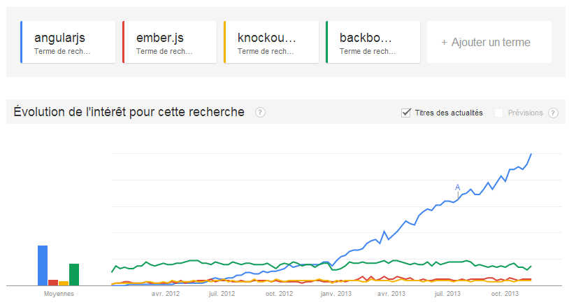

!SLIDE subsection ====================================================================================

# nouveaux clients JS

!SLIDE ============================

# frameworks JS
# SPA

!SLIDE ============================

!SLIDE ============================

!SLIDE bullets ============================

* templates déclaratifs
* data binding
* composants réutilisables
* beaucoup moins de code

!SLIDE image ============================

# présentation côté client

!SLIDE bullets ============================

* client réactif
* architecture simple
* API serveur de type REST
* montée en charge plus facile
* client-serveur dans le browser

!SLIDE image ============================

# JavaScript natif

!SLIDE image ============================

