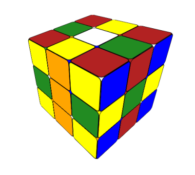

!SLIDE subsection ====================================================================================

# HTML5, CSS3...

!SLIDE bullets ============================

# CSS

* Transitions CSS
* Animations CSS
* Transformations CSS 2D & 3D

!SLIDE bullets ============================

# touch events

## + libs JS

!SLIDE bullets ============================

# responsive design

!SLIDE bullets ============================

# historique du navigateur

### Single Page Application

!SLIDE bullets ============================

# géolocalisation

    navigator.geolocation.getCurrentPosition(
            function (position) {
        // position.coords.latitude;
        // position.coords.longitude;
        // position.coords.accuracy;
        // position.coords.altitude;
        // position.coords.altitudeAccuracy;
        // position.coords.heading;
        // position.coords.speed;
    });

!SLIDE bullets ============================

# stockage local

* Web Storage
* IndexedDB
* Web SQL _(deprecated)_
* File System

!SLIDE image ============================

!SLIDE bullets ============================

# noBackend
## (commercial)

!SLIDE bullets ============================

# noBackend
## (open source)

<table>
 <tr><td rowspan="2"></td></tr>
 <tr><td>
     </td></tr>
</table>

!SLIDE bullets ============================

# frontend = backend

 

## Meteor (GPL)
 
## Derby (MIT)

!SLIDE image ============================

## Google Drive
# Real-Time API

http://miniurl.org/cube

!SLIDE bullets ============================

# SEO (TODO)

