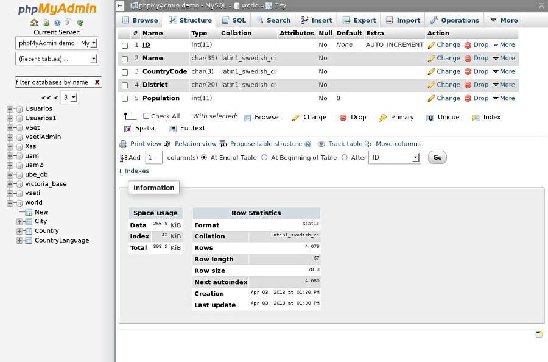

!SLIDE ====================================================================================

# architecture des
# applications web modernes

!SLIDE bullets small moi ============================

<table>
<tr><td></td><td>Thierry Chatel  </td></tr>
</table>

* Consultant indépendant
    * architecture des applications web
* Formateur AngularJS & JavaScript

 
<table id="reseaux">
<tr>
<td>tchatel@gmail.com</td>
<td>@ThierryChatel</td>
<td>+ThierryChatel</td>
<td>tchatel</td>
</table>

 

Slides sur GitHub : http://miniurl.org/archiweb

!SLIDE subsection ============================

# applis web modernes

!SLIDE image ============================

!SLIDE image ============================

!SLIDE ============================

!SLIDE ============================

!SLIDE ============================

!SLIDE ============================

!SLIDE ============================

!SLIDE image ============================

