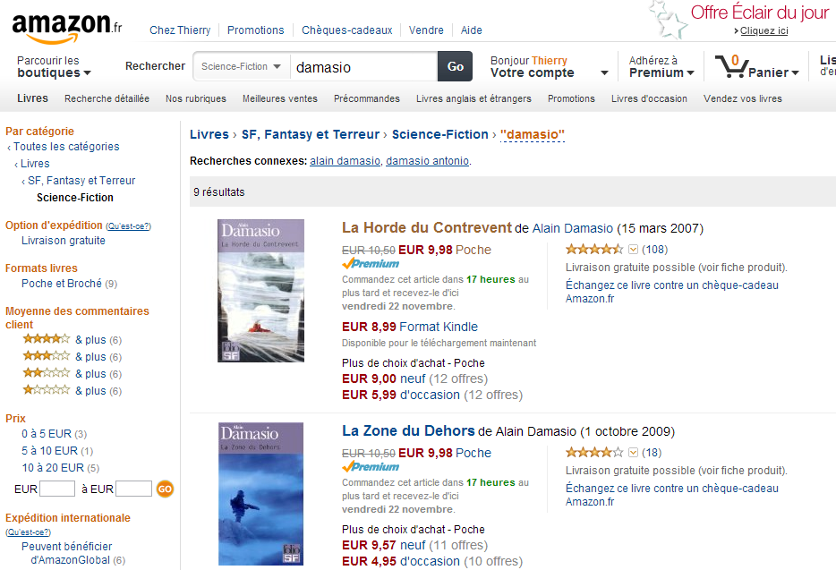

!SLIDE subsection ====================================================================================

# sites publics

!SLIDE bullets ============================

* applications ouvertes au public
* sites e-commerce
* CMS

!SLIDE image ============================

!SLIDE image ============================

!SLIDE bullets ============================

# SEO

* générer des pages brutes par du code serveur
    * sorte de sitemap pour les crawlers
* faire tourner l'appli côté serveur et enregistrer les pages
    * 

